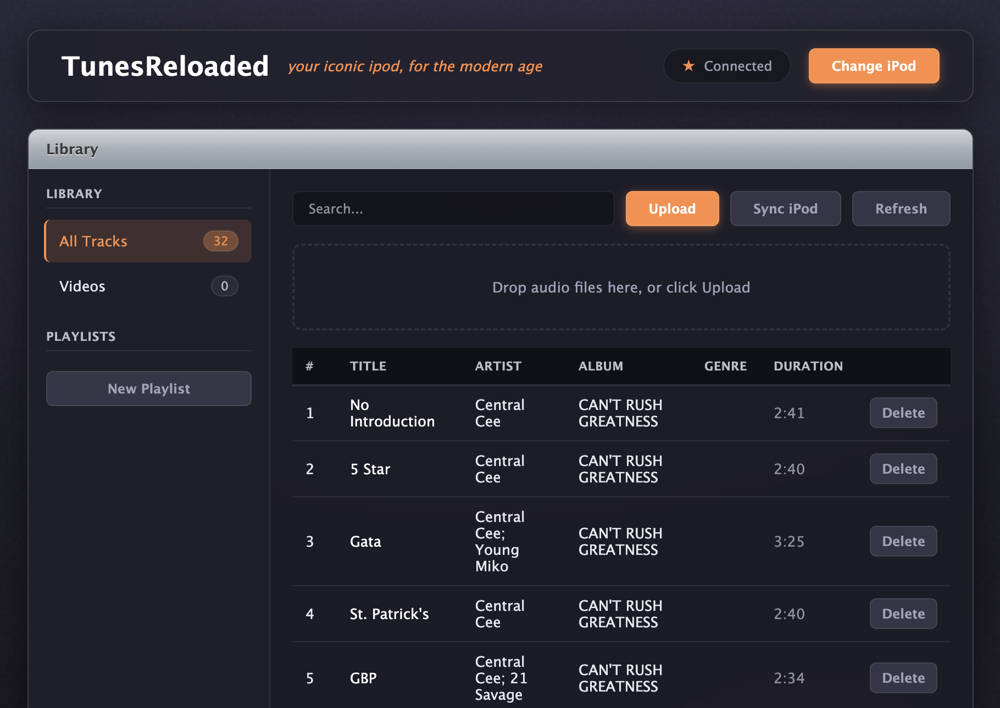
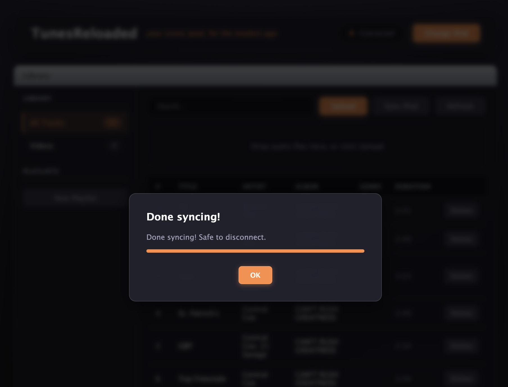

# TunesReloaded Reworked

> [!IMPORTANT]
> This repository is a **rework** of the original TunesReloaded project.
> The original project is available at: https://github.com/rish1p/tunesreloaded

TunesReloaded Reworked is a browser-based tool for managing music on classic iPods.  
This rework keeps the original spirit while focusing on practical compatibility, reliability, and usability improvements.

## Changelog

The full change history lives in `CHANGELOG.md`.

How to read it:
- Entries are grouped by date (`YYYY-MM-DD`).
- Each date groups bullets by area (docs, compatibility, sync reliability, UI fixes, etc.).
- Start from the most recent date at the top for the latest state of the rework.

## What This Rework Focuses On

- Better browser compatibility behavior (including Brave guidance)
- Capability-based feature gating instead of broad startup blocking
- Clearer error handling for missing File System Access and WebUSB APIs
- More reliable filesystem sync behavior
- UI/UX quality-of-life adjustments

## Core Features

- Manage tracks and playlists from the iPod database
- Add and remove tracks, then sync in one batch
- Upload from file picker, folder picker, or drag-and-drop
- FLAC upload support via browser transcoding pipeline
- Works on modern Chromium-based browsers

## Quickstart

1. Open TunesReloaded Reworked in a Chromium-based browser (Chrome / Edge / Brave).
2. Connect your iPod to your computer.
3. Select the **root folder of the iPod drive** when prompted.
4. If prompted for setup guidance (for example in Brave), follow the on-screen instructions and retry.
5. Add songs via upload or drag-and-drop.
6. Click **Sync iPod** to write files and update the database.
7. Safely disconnect your iPod.

## Technical Notes

- File access is handled through the File System Access API.
- Some device setup flows rely on WebUSB when available.
- iPod database read/write is powered by `libgpod` compiled to WebAssembly.
- FLAC handling uses `ffmpeg.wasm` for browser-side conversion where needed.

## Known Limitations

- Album artwork support is not implemented yet.
- Performance may vary on large upload/transcode batches.
- Some iPod models may require extra setup steps.

## Attribution

This rework is based on the original TunesReloaded project and its upstream work:
https://github.com/rish1p/tunesreloaded

If you want to support the original creator, you can buy him a coffee:
https://buymeacoffee.com/riship1

## Disclaimer

This rework is heavily vibecoded and should be treated as an experimental/community-maintained variant.

Technical note about the implementation process:
- A large portion of edits were produced with AI coding assistance.
- The assistant used was OpenAI Codex (a coding agent workflow) based on a GPT-5 class model.
- Changes were made through iterative prompt-driven development, patching, and lots of manual validation.
